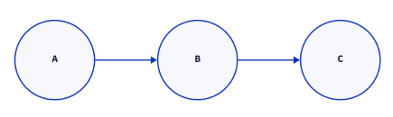

# 위상 정렬(Topological sort)
- 사이클이 없는 방향 그래프(DAG)에서 정점을 선형으로 정렬하여 나타내는 것을 의미한다.
-  사이클이 있거나 방향그래프가 아닐 경우 즉, DAG가 아닐 경우 위상 정렬은 불가능 하다

**선형 정렬 예시**
-



그래프가 위처럼 구성되어 있을 때 C가 출력이 되기 위해서는 B가 나와야 하고 B가 나오기전에는 A가 나와줘야 한다. 따라서 C가 나오기 전에는 A와 B가 나와줘야 한다.


그래프가 해당 형태로 구성되어 있을 때 C가 나오기 위해서는 A와 B가 모두 나와줘야 한다.
그 반면 A나 B의 경우에는 둘 중 어느 것이 앞에 있더라도 상관이 없다.


**구현 방법**
-

- 구현의 핵심은 그래프 순회에서 indegree(들어오는 차수)를 사용하는 것이다.

- indegree는 말그대로 다른 노드에서 들어오는 간선을 이야기하는 것으로 해당 노드로 도착하기 위해서는 그 노드들을 통해야한다.

- 그러한 특성과 한 번 사용한 간선은 재사용 되지 않는다는 방향그래프에서의 그래프 순회의 특성을 이용하여 그 노드로 들어오는 간선이 모두 사용되지 않으면 해당 노드를 방문하지 않게 한다면 해당 노드보다 먼저 와야하는 노드가 뒤에 나오는 일은 일어날 수가 없다.

**코드 예시**
-
**bfs를 이용한 위상 정렬 예시**

bfs 시작 지점 입력
```c++
for (int i = 1; i <= n; i++) {
	if (indegree[i]==0) {
		q.push(i);
	}
}
```

bfs부분
```c++
while (!q.empty())
{
	int now = q.front(); q.pop();
	cout << now << " ";
	for (auto v : graph[now]) {
		indegree[v]--;
		if (indegree[v] == 0) {
			q.push(v);
		}
	}
}
```


**추천 문제**
- [2252번 줄 세우기](https://www.acmicpc.net/problem/2252)
- [1005번 ACM Craft](https://www.acmicpc.net/problem/1005)

